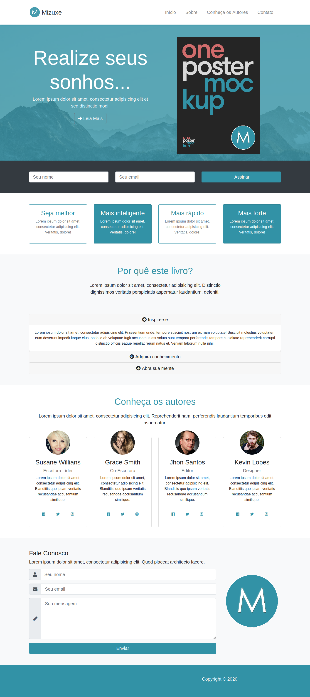

# mizuxe-book-presentation
 
## Project

***EN:*** This project is a single page website that presents and also provides useful information about a fictional book called mizuxe, created during the Bootstrap 4 From Scratch With 5 Projects course, taught by Brad Traversy.

***PT-BR:*** Este projeto é um website de página única que apresenta e também fornece informações úteis sobre um livro fictício chamado mizuxe, criado durante o curso Bootstrap 4 From Scratch With 5 Projects, ministrado por Brad Traversy.

## Specifications
- Added a showcase section with an introduction and book cover
- Added an about section with some information from the book using accordions
- Added the authors area and contact section
- Added smooth scrolling behavior
***

## Technologies

This project was developed with the following technologies:

- HTML
- CSS
- Bootstrap
- SASS
***
 
## Preview

***

## License

This project is under the MIT license.
